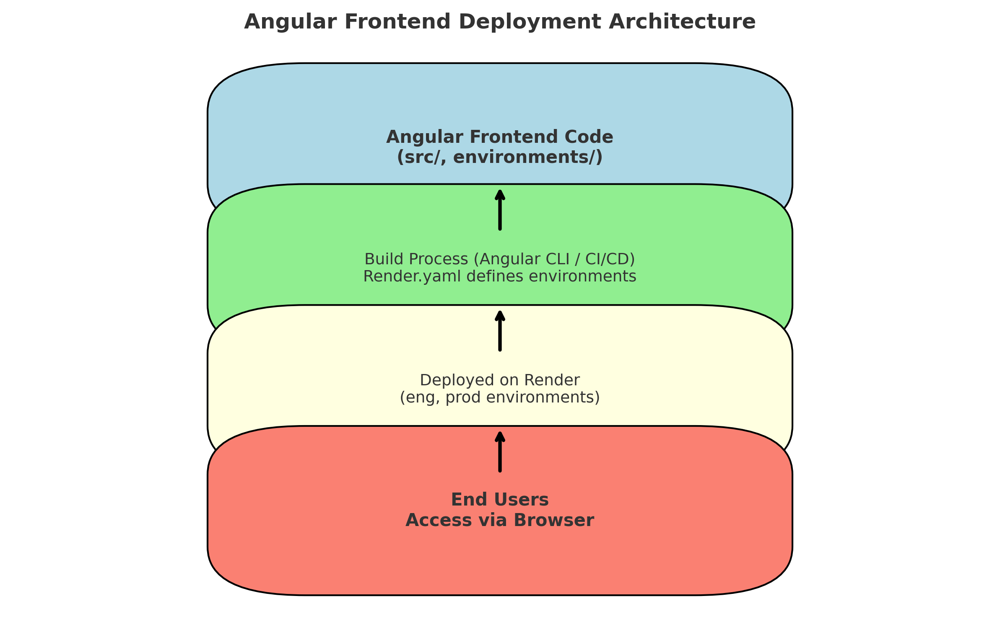

# Angular Frontend


This is the frontend application for the NodeJS and Python backend projects.  
It is built with [Angular](https://angular.io/), follows a modular architecture, and is designed to work seamlessly with the backend services deployed on Render.

---

## Table of Contents

- [Overview](#overview)
- [Getting Started](#getting-started)
- [Scripts](#scripts)
- [Commit Guidelines](#commit-guidelines)
- [Environments](#environments)
- [Architecture](#architecture)

---

## 📌 Overview

This repository contains the **Angular frontend** for the project.  
It communicates with the [NodeJS backend](https://github.com/Shankar0919/nodejs-backend) and [Python backend](https://github.com/Shankar0919/python-backend).

---

## 🚀 Getting Started

### Installation

```bash
git clone <repo-url>
cd angular-frontend
npm install
```

### Running the App

```bash
npm start
```

The app will be available at `http://localhost:4200` when you run in local.

---

## 📜 Scripts

| Command         | Description                    |
|------------------|--------------------------------|
| `npm run start`  | Run the server                 |
| `npm run build`  | Build for development          |
| `npm run test`   | Run unit tests                 |
| `npm run lint`   | Run ESLint checks              |

---

## Commit Guidelines

- Do **not** commit directly to `master`.  
- Create a feature branch:  

  ```bash
  git checkout -b feature/my-change
  ```

- Commit with meaningful messages:  

  ```bash
  git commit -m "feat(ui): add new dashboard component"
  ```

- Push and open a Pull Request for review.  

---

## 🌍 Environments

The application is deployed on [Render](https://render.com) across three environments:

| Environment | Angular UI URL                                       | NodeJS API URL                                     | Python API URL |
|-------------|------------------------------------------------------|----------------------------------------------------|----------------|
| Eng         | <https://shankar-angular-frontend-eng.onrender.com/> | <https://shankar-nodejs-backend-eng.onrender.com/> | _TBD_          |
| Test        | <https://shankar-angular-frontend-test.onrender.com/>| <https://shankar-nodejs-backend-test.onrender.com/>| _TBD_          |
| Prod        | <https://shankar-angular-frontend-prod.onrender.com/>| <https://shankar-nodejs-backend-prod.onrender.com/>| _TBD_          |

---

## Architecture


---